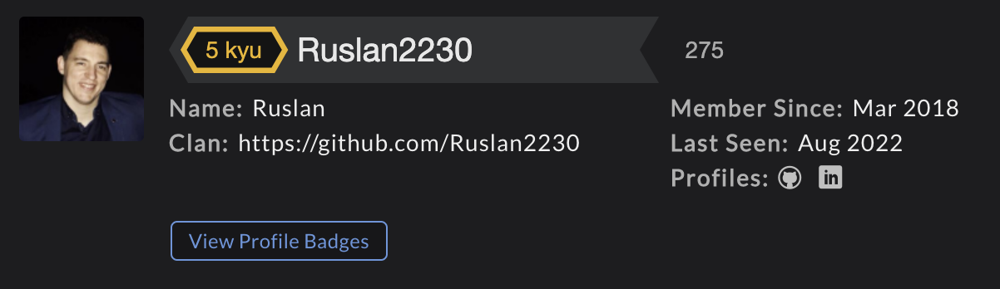

<!--  -->

<!-- 

  
  

 -->

<!-- ## My top projects

 -->

<!--
 

    

 -->

  

 
<h2 style="margin-bottom: 25px" align="center">
  🛠 Languages | Tools | Experience 💻 Software 💻 🛠
 </h2>

  

<!-- ## 📈  Stats

 
  -->

 <!---->

 <h1 align="left">Profiles:</h3>

|CodeWars|
 :----- |
||

 <!-- ## Time for fun
 |Random meme| Dynamic quote|
|:--- |:---- |
| | | -->

 <!--
  
-->

## 📫 How to reach me
<a href="mailto:gritsak5@gmail.com"> 

<!-- 

    
<b>Yes</b>
 

## trust me
 
 
  -->

<!--🦶FOOTER-->
<!--  -->

 

 

